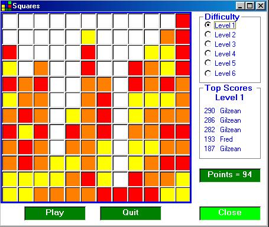



## Squares Board Game

### Description

The object of this game is to score as many points as possible by removing coloured squares from the grid. This is done by clicking on a square that is the same colour as its neighbour (above, below, left or right)

All contiguously coloured squares in each direction will be removed and the squares above will drop down. If this is not clear, right click a square to see which will be removed. More points are scored for removing lots of squares in one go and a bonus is scored for completing a level.
 
### More Info
 

             |
---                |---
**Submitted On**   |2003-09-14 15:26:52
**By**             |[Gilzean](https://github.com/Planet-Source-Code/PSCIndex/blob/master/ByAuthor/gilzean.md)
**Level**          |Intermediate
**User Rating**    |5.0 (15 globes from 3 users)
**Compatibility**  |VB 5\.0, VB 6\.0
**Category**       |[Games](https://github.com/Planet-Source-Code/PSCIndex/blob/master/ByCategory/games__1-38.md)
**World**          |[Visual Basic](https://github.com/Planet-Source-Code/PSCIndex/blob/master/ByWorld/visual-basic.md)
**Archive File**   |[Squares\_Bo1645959162003\.zip](https://github.com/Planet-Source-Code/gilzean-squares-board-game__1-48492/archive/master.zip)

